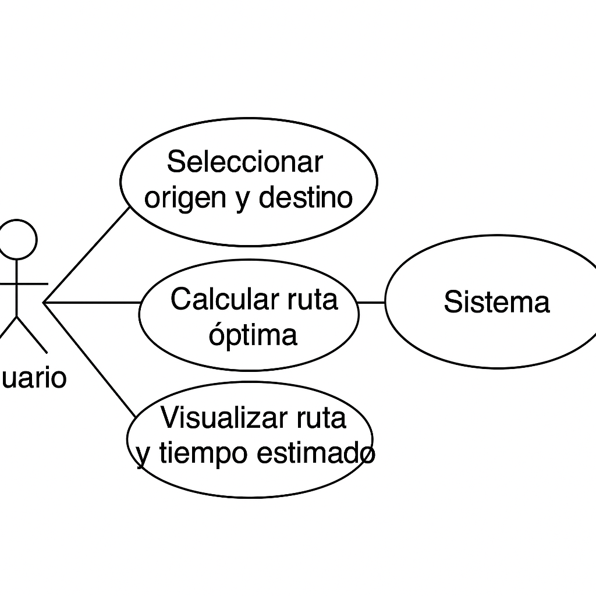
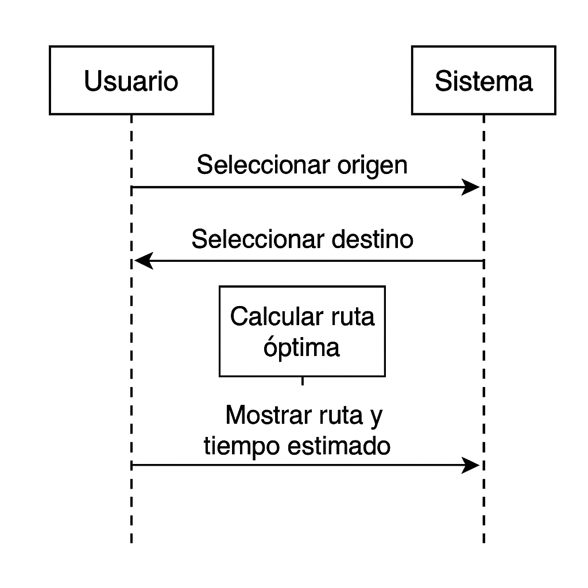

# udlap-navigator

Sistema de navegación por grafo para la UDLAP usando Java

## 🚀 Descripción
Este sistema permite calcular la **ruta más corta entre dos ubicaciones** dentro del campus de la Universidad de las Américas Puebla (UDLAP), utilizando grafos ponderados y el algoritmo de Dijkstra.

## 🎯 Objetivo
Facilitar la navegación entre puntos estratégicos del campus, optimizando el tiempo de traslado entre ellos.

## 🛠️ Tecnologías utilizadas
- Java 8+
- Algoritmo de Dijkstra
- Estructura de datos tipo grafo
- Interfaz gráfica con Java Swing

## 💡 Cómo usarlo

### 1. Compilar el proyecto
```bash
javac src/*.java
```

### 2. Ejecutar desde la terminal
```bash
java -cp src Main
```
Este modo es en consola.

### 3. Ejecutar interfaz gráfica (Swing)
```bash
java -cp src NavigatorGUI
```

## 🖼️ Interfaz gráfica
La interfaz desarrollada con Java Swing permite:
- Seleccionar el **punto de origen y destino** con nombre y letra (por ejemplo: `A - Humanidades`)
- Calcular la **ruta óptima** utilizando el algoritmo de Dijkstra
- Visualizar la ruta paso a paso incluyendo nombres de nodos
- Mostrar el **tiempo estimado** en minutos

### Ejemplo de uso:
```bash
--- Navegador UDLAP ---
Lugar de origen (A-O): A
Lugar de destino (A-O): E
Ruta óptima: A (Humanidades) -> C (Hacienda) -> D (Negocios) -> E (Auditorio)
Tiempo estimado: 15 minutos
```

## 🧭 Estructura del repositorio
```
udlap-navigator/
├── src/
│   ├── Graph.java
│   ├── Dijkstra.java
│   ├── Main.java
│   └── NavigatorGUI.java
├── README.md
└── doc/
    ├── use-case.png
    └── sequence.png
```

## 📊 Diagramas UML

### Diagrama de Casos de Uso
Este diagrama muestra cómo el usuario interactúa con el sistema.



### Diagrama de Secuencia
Este diagrama representa el flujo de interacción entre el usuario y el sistema.


